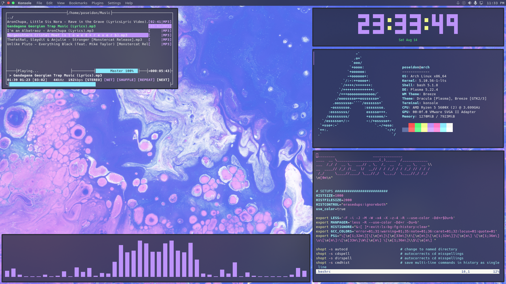

# Current Rice : [KDE Plasma] - Dracula All In 🧛‍♂️



<h3 align="center">&bull; &bull; &bull;</h3>


<h3 align="center">&bull; &bull; &bull;</h3>


<h3 align="center">&bull; &bull; &bull;</h3>

## [KDE Plasma Setup](./assets/kde-setup)

## [Wallpaper](https://github.com/poseidon-code/wallpapers)

## [Panel](./assets/panel)

## [Dolphin](./assets/dolphin)

## [Konsole](./assets/konsole)

## Packages

```bash
sudo pacman -S neovim moc nano konsole kate dolphin firefox lsd bat pulseaudio-alsa ranger base base-devel htop git neofetch nodejs npm python libdbusmenu-glib gwenview elisa ark vlc
yay -S cava peaclock visual-studio-code-bin
```

## Miscelenous Setup

> Setup pacman
>
> ```bash
> sudo nano /etc/pacman.conf
> ```
>
> uncomment : `Color` \
> uncomment : `ParallelDownloads = 6` \
> Save <kbd>Ctrl</kbd> + <kbd>O</kdb>
>
> Exit <kbd>Ctrl</kbd> + <kbd>X</kdb>

> Setup Mirrors
>
> ```bash
> sudo pacman -S reflector
> sudo reflector --latest 5 --sort rate --country 'India' --save /etc/pacman.d/mirrorlist
> sudo pacman -Syyuu
> ```

> Setup yay AUR Helper
>
> ```bash
> git clone https://aur.archlinux.org/yay-git.git
> cd yay-git/
> makepkg -si
> sudo pacman -Rs $(pacman -Qdtq)
> sudo pacman -Scc
> cd ..
> sudo rm -rf yay-git
> ```

> For KDE Discover to work
>
> ```bash
> sudo pacman -S packagekit packagekit-qt5
> ```

> Panel Buttons \
> https://store.kde.org/p/1272871/

> Setup dotfiles \
> Copy all dot files from this repository to their respective directories.

> Setup Konsole Color Scheme \
> https://draculatheme.com/konsole
